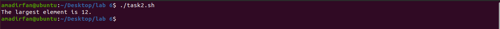

# Lab Tasks

###Part(a):

**Create a Bash script to find the first repeating element in an array of integers.**

**Description:**

In this file we will check repeating element in array.

first we declare an array name count using `declare -A count`  then a static array name `arr`

 Then enter its values in circle brackets and we write a loop After adding its values to `count` array

the loop will be end.

then we set a new loop to compare values of `count` array.

After its completion we print out its result.

**Solution:**

```bash
#!/bin/bash

declare -A count
arr=(2 3 4 2 5 6 2 2 2 2 1 3 7 7 7 8 9)

for i in "${arr[@]}"; do
  count["$i"]=$((count["$i"]+1))
done

element=""
count=0
for i in "${!count[@]}"; do
  if (( count["$i"] > count )); then
    count=${count["$i"]}
    element="$i"
  fi
done

echo " $element occures $count times."
```

**Code:**


**Output:**


###Part(b):

**Create a Bash script to find the largest element of a given array of integers.**

**Description:**

In this file we find largest value of array.

first we declare an array name `arr`. and set first element of array to `maximum` then run a for loop 

and compare every values of array maximum values

After its completion we print it on console. 

**Solution:**

```bash
#!/bin/bash

arr=(4 3 2 2 3 4 1 3 4 2 3 4 5 1 3 2 4 1 2 3 1 2 3 2 3 1 2 1 0 2 8 5 12 3 9)

maximum=${arr[0]}

for i in "${arr[@]}"; do
  if (( i > maximum )); then
    maximum=$i
  fi
done
echo "The largest element is $maximum."

```

**Code:**


**Output:**



###Part(c):

**Create a Bash script to separate 0s and 1s from a given array of values 0 and 1.**

**Description:**

In this part we separate `0's` and `1's`  in current arrays.

So we declare 3 static arrays name `arr`,`arrz` for zero's and `arro`  for one's. then we run a for loop to get zero's and another for loop to get one's.

After completion we print out both of arrays on cmd.

**Solution:**

```bash
#!/bin/bash
arr=(0 1 0 0 1 1 1 0 1 0)
arrz=()
arro=()
for i in "${arr[@]}"; do
  if (( i == 0 )); then
    arrz+=($i)
  elif (( i == 1 )); then
    arro+=($i)
  fi
done
echo "zero: ${arrz[@]}"
echo "ons : ${arro[@]}"
S
```

**Code:**


**Output:**


###Part(d):

**Create a Bash script to find the most occurring element in an array of integers.**

**Description:**

in this code we find most occurring values in array.

so declare array name  `occ` and a static array name `array`

then run a for loop to find 1st element which occurs most.we get an element and compare it with others and print it if occurs most time . If not found then return `not found`.

**Solution:**

```bash
#!/bin/bash

declare -A occ

array=(3 1 5 1 5 7 9 7 9)


for i in "${array[@]}"; do
  if [[ -n "${occ[$i]}" ]]; then
    echo "The first element repeats is $i."
    exit 0
  else
    occ["$i"]=1
  fi
done

echo "Not found."
exit 1

```

**Code:**


**Output:**


# The End

