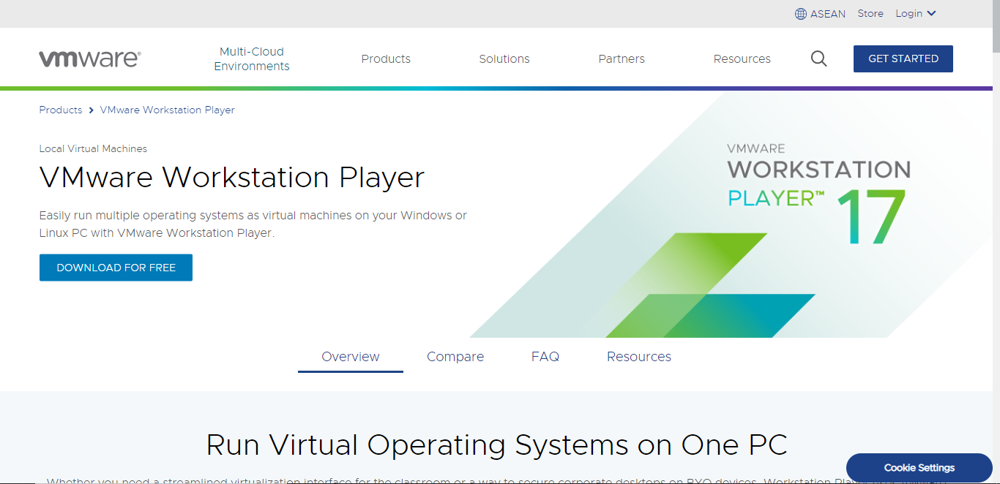

# Linux installation on VM ware

Linux is a open-source operating systems. They are based on the Linux kernel and are free to download.

**First you have to install VMware Workstation Player Follow given Link. **

https://www.vmware.com/asean/products/workstation-player.html

**click on button Download For Free.**

##### **After downloading open VMware software by double click if you're a window user and install like  a normal software. Follow these steps.**

Click on Next Button.

Click on next. 

 VM ware install successfully. Now you can install (Linux).

**Download a Linux ISO format.** An ISO file is a disk image. Some of the top options are [Ubuntu](https://ubuntu.com/download/desktop). They are free to download from each distribution’s main website. For this article, we are using Ubuntu.

**You can Download Ubuntu using link.**[Ubantu](https://ubuntu.com/desktop)

**After click on this link following window appear. **

 **After downloading software open VMware and Follow the following Steps. **

Click on **"Create new Virtual Machine".**

Click on Button **"Next" to continue process.**

Enter Full Name ,User Name in lowercase alphabets and also enter password and confirm Password.select disk size you want to given to virtual Machine.Click on **"Next Button"** .Then **installation** will start.

 **Installation is in process.**

**Installation is completed.** Now we can use Linux on or computer.

**Enter Password you have set in start. **

**Now Installation has been completed .**

 you can enjoy Linux.