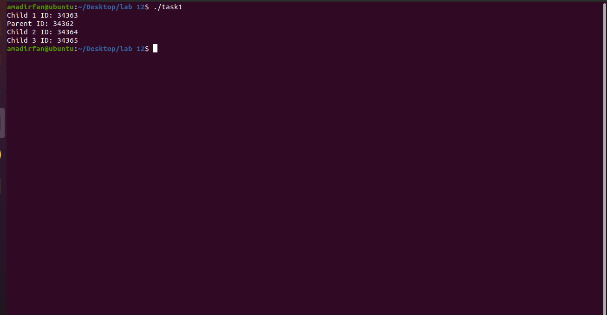
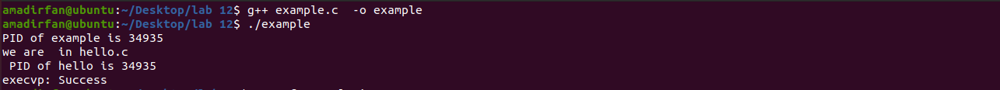
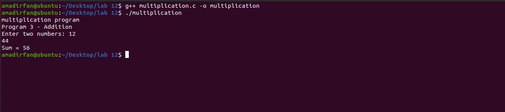
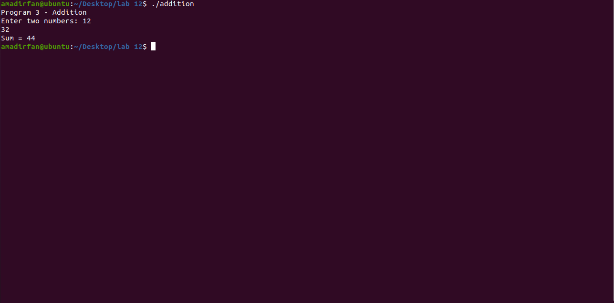
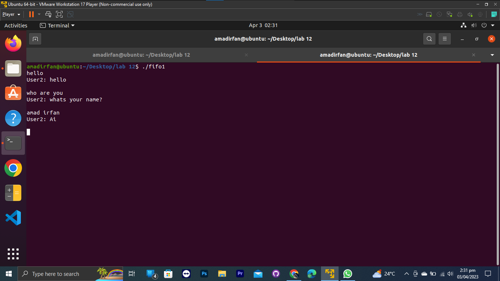
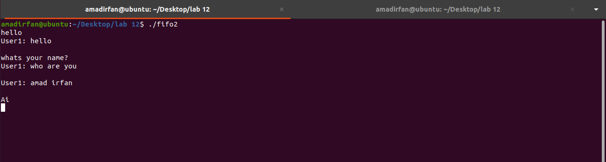

# Operating System Lab-12 

### Amad Irfan 

### Reg No 2021-CS-25

# Task1

Write a program to create one parent with three child using two fork() function where each process find its Id.


* ```c
   #include <stdio.h>
   #include <unistd.h>
   #include <sys/types.h>

   int main() {
       pid_t child1, child2, child3;

       child1 = fork();
       if (child1 == 0) {
           // First child process
           printf("Child 1 ID: %d\n", getpid());
       } else {
           child2 = fork();
           if (child2 == 0) {
               // Second child process
               printf("Child 2 ID: %d\n", getpid());
           } else {
               child3 = fork();
               if (child3 == 0) {
                   // Third child process
                   printf("Child 3 ID: %d\n", getpid());
               } else {
                   // Parent process
                   printf("Parent ID: %d\n", getpid());
               }
           }
       }
   return 0;
   }
   ```

   ​

    


***

# Task 2 

Create two C or .cpp files, example and hello and replace the example with hello by calling exec() function in example. Output should be like

 * ```c
    #include <unistd.h>
    #include <stdio.h>

    int main() {
     char *args[] = {"./hello", NULL};
        pid_t child=fork();
        printf("PID of example is %d \n",child );
        printf("we are  in hello.c\n ");
        execvp(args[0], args);
        printf("PID of hello is %d \n ", child);

        perror("execvp");  // This line will only be executed if execvp fails
        return 1;
    }
    ```

    

# Task 3

Create two .C or .cpp files, multiplication and addition and replace the multiplication with addition by calling exec() function in multiplication.

```C
#include <stdio.h>
#include <stdlib.h>
#include <unistd.h>

int main() {
    printf("multiplication program\n");

    char* args[] = {"./addition", NULL};
    execv(args[0], args);

    printf("This should not be runed\n");
    exit(EXIT_FAILURE);
}


```



Addition Program

```C
#include <stdio.h>
int main() {
    printf("Program 3 - Addition\n");

    int num1, num2, sum;

    printf("Enter two numbers: ");
    scanf("%d %d", &num1, &num2);

    sum = num1 + num2;

    printf("Sum = %d\n", sum);

    return 0;
}

```




## FIFO Tasks

### Fifo1



## FIfo2



