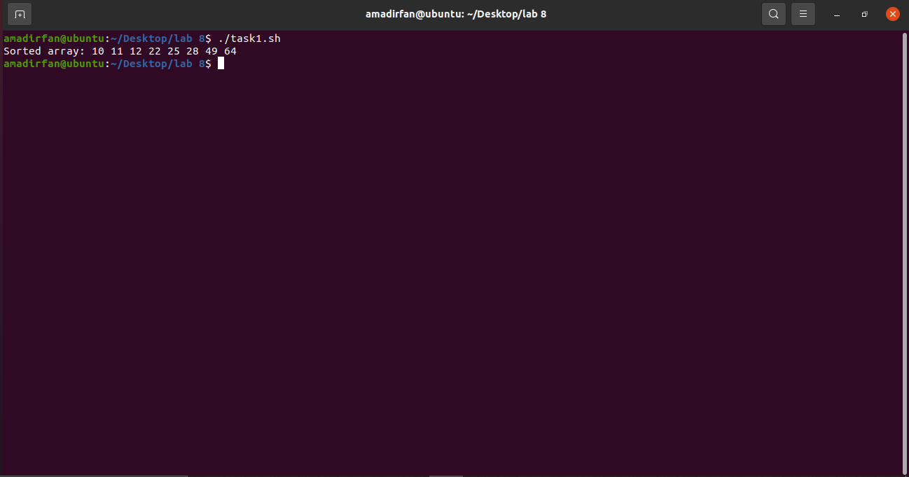
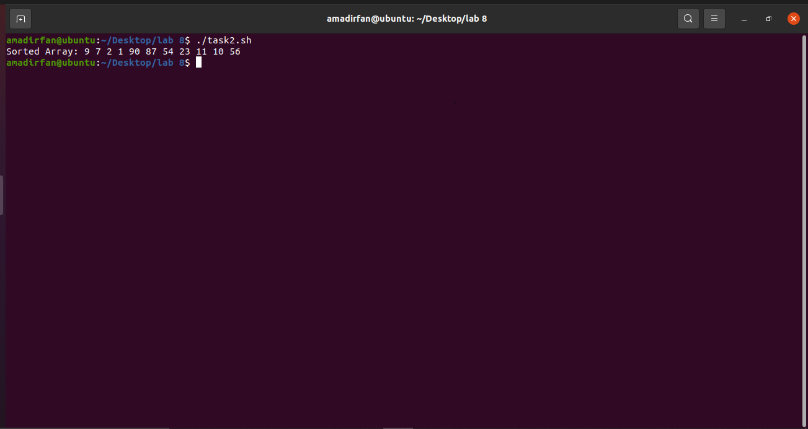

### 2021-CS-25 lab 07

## Task 01

##### Insertion Sort is a simple sorting algorithm that iterates over an array of elements, comparing each pair of adjacent elements, and swapping them if they are in the wrong order.

The algorithm starts with the first element of the array and assumes that it is already sorted. It then moves to the second element, compares it to the first element, and swaps them if necessary to maintain the sorted order. It continues this process for each subsequent element, inserting it into its correct position in the sorted sub list.

The steps involved in the insertion sort algorithm are

1. Starting from the second element, compare the current element with the one before it.


2. If the current element is smaller than the previous one, swap them.
3. Continue comparing the current element with the previous ones and swapping if necessary until         the current element is in its correct position.


4. Repeat the above steps for all elements in the array until the entire array is sorted.

Insertion sort has a time complexity of O(n^2) in the worst-case scenario, where n is the number of elements in the array. However, it performs well on small data sets and is often used as a subroutine in more complex sorting algorithms.

##### Here is the code of insertion sort in bash.

```bash
#!/bin/bash

unOrderArray=(64 25 12 22 11 10 28 49)


Algorithm01() {
    array=("$@") 
    n=${#unOrderArray[@]} 
    for ((i=1;i<n;i++))
    do
        key=${array[$i]}
        j=$((i-1))
        while [ $j -ge 0 ] && [ ${array[$j]} -gt $key ]
        do
            array[$((j+1))]=${array[$j]}
            j=$((j-1))
        done
        array[$((j+1))]=$key
    done
    echo "${array[@]}"
}

result=$(Algorithm01 "${unOrderArray[@]}")

echo "Sorted array:" $result
```

##### The Following Output will be shown.




## Task 02

Bubble sort is a simple sorting algorithm that repeatedly steps through the list to be sorted, compares adjacent elements and swaps them if they are in the wrong order. The pass through the list is repeated until the list is sorted. The algorithm gets its name from the way smaller elements "bubble" to the top of the list.

Here is a step-by-step description of how the bubble sort algorithm works:

1. Start at the beginning of the list.


2. Compare the first two elements. If the first is greater than the second, swap them.


3. Move to the next pair of elements, compare them and swap if necessary.


4. Continue this process for each pair of adjacent elements until the end of the list is reached.


5. At this point, the largest element should be at the end of the list.


6. Repeat the above steps for all elements except the last one.


7. After each pass through the list, the next largest element will "bubble" to its proper position.


8. The algorithm stops when no more swaps are needed, which means that the list is sorted.

```bash
#!/bin/bash

arr=(9 7 2 1 90 87 54 23 11 10 56)


Algorithm02() {
    array=("$@")
    num=${#arr[@]}

    for ((i = 0; i < num-1; i++))
    do
        swapping=false
        for ((j = 0; j < num-i-1; j++))
        do
            if [[ ${array[j]} -gt ${array[j+1]} ]]
            then
                temp=${array[j]}
                array[j]=${array[j+1]}
                array[j+1]=$temp
                swapping=true
            fi
        done
       if [ $swapping == false ]
        then
            break
        fi
    done
    echo "${arr[@]}"
}
sort=$(Algorithm02 "${arr[@]}")
echo "Sorted Array: $sort"
```

##### The following output will be shown.



