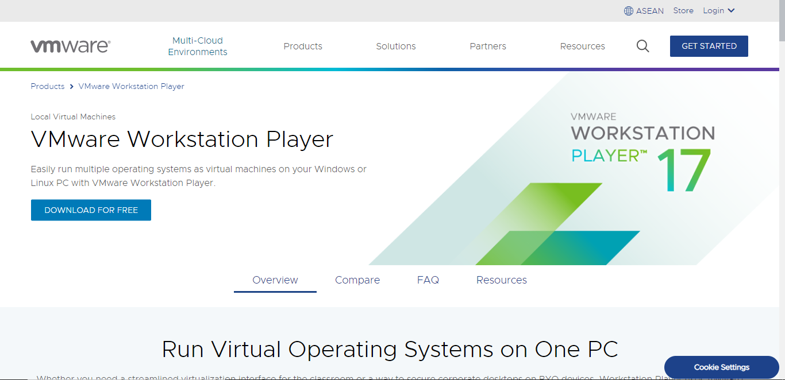
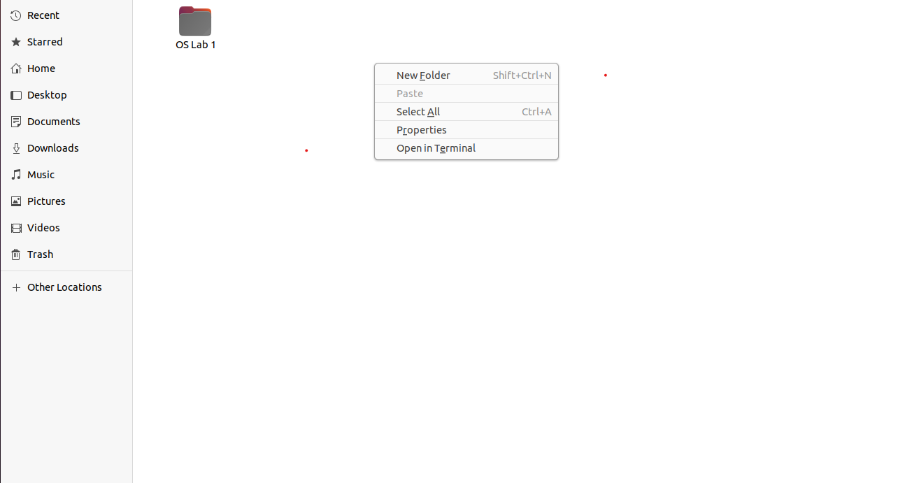
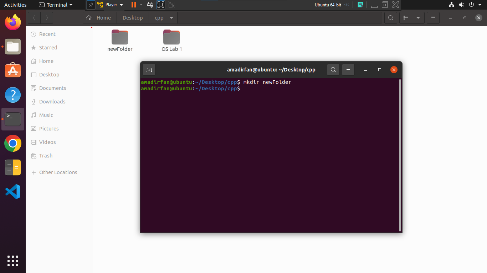
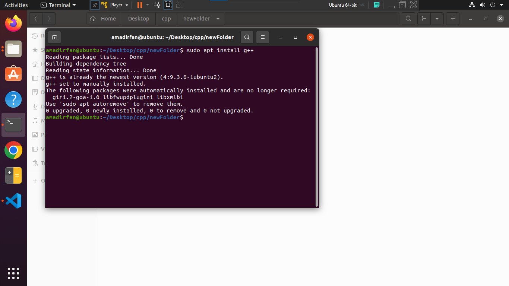

# Task 1


## Linux installation

Linux is a family of open-source operating systems. They are based on the Linux kernel and are free to download. They can be installed on either a Mac or Windows computer. Here’s how to install Linux on a Windows 10 PC. 

#### step 1

**First you have to install VMware Workstation Player from the link below to create virtual machine. **

https://www.vmware.com/asean/products/workstation-player.html



**click on button Download For Free.**

##### **After downloading go to directory where you have download VMware software double click if you're a window user and install like  a normal software. Following windows will show.**


**Click on Next Button**.


**Accept License and Click on Next. **


**After completing the following process. VM ware install successfully now we are able to install Ubuntu(Linux) on our computer.**

#### step 2

**Download a Linux distro in ISO format.** An ISO file is a disk image. Some of the top options are [Ubuntu](https://ubuntu.com/download/desktop), [Mint](https://linuxmint.com/download.php), or [Fedora](https://getfedora.org/). They are free to download from each distribution’s main website. For this article, we are using Ubuntu.

**You can Download Ubuntu using link given blow.**

https://ubuntu.com/desktop

**After click on this link following window will be appear. **


 **After downloading all software open VMware and Follow the following Steps. Following windows will be shown.**


**Click on "Create new Virtual Machine".**


**Click on Button "Next" to continue process.**


**Enter Full Name ,User Name in lowercase alphabets "abc123" and also enter password and confirm it. this pass will show when we successfully install ubuntu on VM ware.**


select disk size you want to given to virtual Machine.Then **installation** will start.


 File are copying **Installation is in process.**


**Installation is completed.** Now we can use Linux on or computer.


**Enter Password we set in start.** The following windows will appear.


if you want to set any account you can. but you can skip by **Clicking on Top Right "Skip" Button.**

**Now Installation has been completed .**

 you can enjoy Linux.


# Task2#

After Complete Installation of ubuntu in VMware make any folder using **terminal** or **Right click**  as.




Click on new Folder or press **Shift + Ctrl + N** to create a Folder.

or by Using Terminal you can also create Folder as Follow.



 by using command

```ubuntu
 mkdir FolderName
```

New folder will be create.

Now open previously created Folder and create a **.cpp** file using Terminal  as.


by clicking on **Open in Terminal**  current folder will be open in terminal.


run **touch task1.cpp** command to create a .cpp file.

```ubuntu
touch task1.cpp
```

file was created. To open or edit you can use different commands  such as **gedit** ,**nano** for opening a editor.

```ubuntu
nano
```

```ubuntu
gedit
```

After Writing your required code press **ctrl + S ** to save code.


After this run a command to convert it to source code.

```ubuntu
g++ task1 -o t	
```


Your code will be compile. If you face any error related to code review your code and run this code again.

to open this file run this command.

```ubuntu
./file
```


**If you want to create all types of file like .io , .exe or .iso type "g++ filename --save-temps".** Run this command.

```ubuntu
g++ like--save-temps
```

If g++ not working then type **"sudo apt install g++"** or **"sudo apt update "** or simply update your ubuntu it will remove all errors. For that type **"sudo apt install build-essentials ".**


```ubuntu
sudo apt update
or
sudo apt upgrade
```

next command.



```ubuntu
sudo apt install g++
```

next command.

```ubuntu
sudo apt install build-essentials
```


your g++ module will install successfully.

### Thanks.

