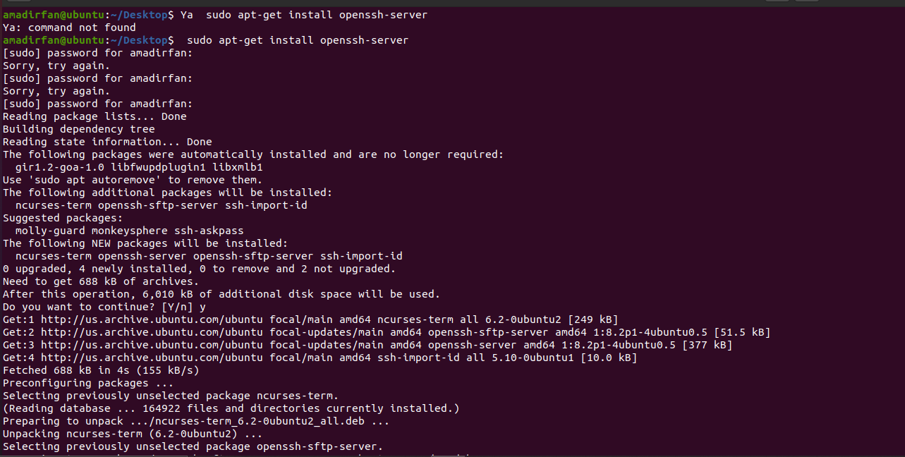

##2021_CS_25           AMAD IRFAN

## Task(Connection between Windows and Ubuntu using SSH).

**(1)** Install **ssh-server**  on ubuntu by this command :

**sudo apt-get install openssh server**. 

openssh-server will installing like this.

**(2)** Install net-tools on ubuntu for running ifconfig command on ubuntu. 

**sudo apt install net-tools**

**(3)** After net-tools installation of run **ifconfig**. It will give the IP address of the ubuntu.

 

**(4)** Now you can test this IP address using ping command on you cmd of windows. Ping Command tests that either given IP address exists or not. 

​ **ping Ubuntu_IP**

**(5)** We can connect our ubuntu server with windows server to show that IP exist or not.

**(i)** Run ls command to check that this correctly work or not.

**(j)** Open Command Line Interface in putty directory and Run command:

**pscp -P 22 "windowfromDirectory" "UbuntuToDirectory"**

To move file from windows directory to ubuntu's directory.Enter ubuntu password again.

**(k)** File is successfully moved.

**(l)** To send file again where it comes from write this command:

**pscp -P 22 ubuntuFromDirectory WindowsToDirectory**

**(m)** File successfully moved back.

