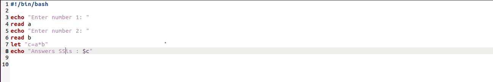
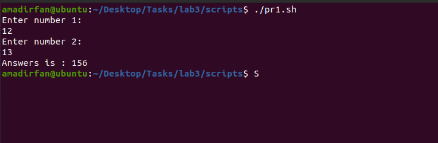
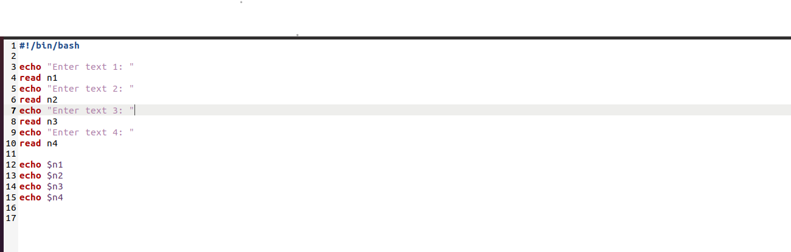
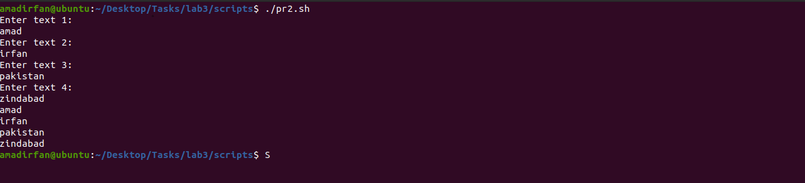
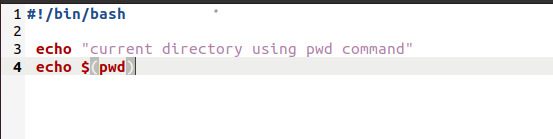
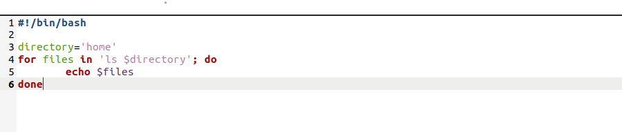
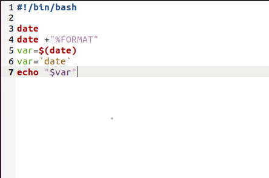
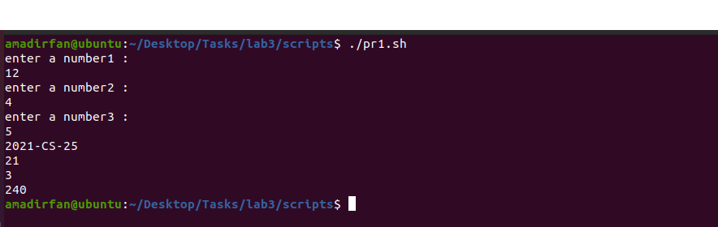

##  TASK 01

**1**.Create a simple script which will take two command line arguments and then multiply them together. 

###Code:



 I get an error of permission denied as


To remove this error use the command 

```
chmod +x pr1.sh
```

After removed error the final output is.

### Output:




**2**.Create a simple script, which will ask the user for a few pieces of information then combine this into a message which is echo'd to the screen.use the following command.

### Code:



### Output:




**3**.Now Mr. Tom suddenly lost the track of his current location. Help him find his location. use the following command.

###Code:



###Output:


**4**.He wants the list of all files present on home directory. use the following command.

### Code:



### Output:


**5**.Display the current time. use the following command



###Output:


**6**.He is done with the task and he is happy with your work. He want to display a thankyou message. use the following command.

###Code:


### Output:


## TASK 02

**1**.Write a simple shell script that uses arithmetic operators (+, -,*) using double parenthesis with printing your own roll # with the results of operations. use the following command.

###Code:


### Output:




**2**.Write a simple shell script that uses all relational operators with printing your own roll # with the results of operations.

### Code:


### Output:


